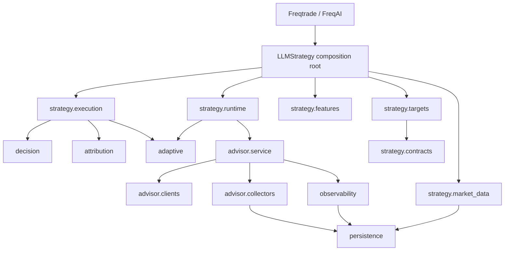
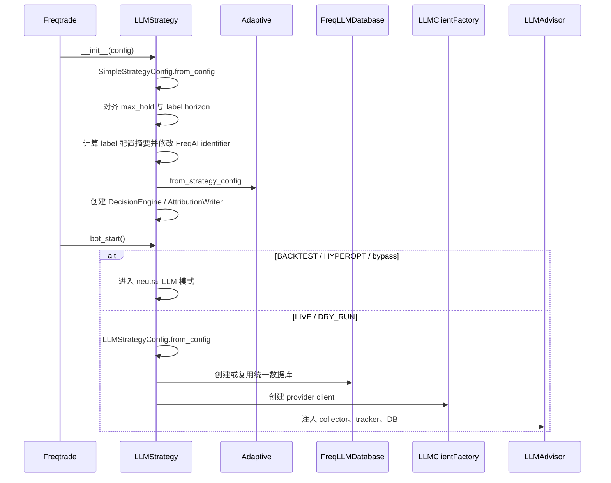

# FreqLLM 架构、原理与实现说明

## 1. 系统定位

FreqLLM 是一个面向永续合约的多空策略系统。它不是“让 LLM 直接下单”，而是由四个彼此约束的部分组成：

1. **FreqAI 多任务模型**：从 K 线、技术指标、关键价位和可选的外部微观结构数据中预测方向、收益分位数和未来价格路径风险。
2. **确定性决策引擎**：按照固定顺序完成数据质量、方向、收益、关键价位、路径质量、LLM 上下文和风险门控。
3. **LLM 慢速上下文过滤器**：只提供市场拥挤、事件风险、方向偏置和杠杆折扣，不拥有直接交易权限。
4. **归因与有界自适应系统**：记录每个候选信号未来真实路径，通过衰减统计、回放、样本外验证和熔断机制调整有限参数。

系统的实际决策关系为：

\[
\text{Candles + Market Context}
\xrightarrow{\text{FreqAI}}
\text{Prediction}
\xrightarrow{\text{Deterministic Policy + LLM Filter}}
\text{Trade Decision}
\]

而不是：

\[
\text{Prompt}\xrightarrow{\text{LLM}}\text{Exchange Order}
\]

### 1.1 核心不变量

- FreqAI 是快速主信号；LLM 不能凭自身意见产生入场。
- `decision` 是唯一的交易决策核心，网络、数据库和文件系统不能进入纯决策计算。
- LLM 只能维持或缩小仓位、杠杆，不能突破 `risk` 的硬上限。
- 标签、回测和外部数据必须保持因果顺序，禁止把信号时点之后才知道的数据作为特征。
- 自适应只调整有边界的策略参数，不得修改固定风险底线。
- 组合风险状态无法读取时 fail-closed，即拒绝新开仓。
- 回测和 Hyperopt 不调用远端 LLM。

## 2. 目录、层次和依赖方向

```text
freqtrade/freqllm/
├── configuration.py               # 顾问/采集器配置、环境变量、URL 与凭据校验
├── decision/
│   └── engine.py                  # 纯领域配置、预测 DTO、LLM DTO、入场/退出引擎
├── strategy/
│   ├── contracts.py               # targets/runtime 共享的有类型数据契约
│   ├── features.py                # FreqAI 特征工程
│   ├── targets.py                 # 标签窗口和执行策略回放标签
│   ├── execution.py               # Freqtrade 入场、退出、stake、leverage、成交回调
│   ├── runtime.py                 # 顾问调度、信号成熟、自适应参数刷新
│   └── market_data.py             # 外部特征读取、缓存、持久化回放和因果对齐
├── advisor/
│   ├── service.py                 # Prompt 编排、Provider 调用、响应校验
│   ├── clients/                   # LLM port、OpenAI/Anthropic/Ollama 等 adapter
│   └── collectors/                # 行情、多空比、账户/持仓上下文
├── attribution/
│   └── writer.py                  # 固定 schema CSV 与未来路径度量
├── adaptive/
│   ├── feedback.py                # 配置、状态、存储和在线更新 manager
│   └── analysis.py                # 衰减统计、策略回放、OOS、熔断、离线 CLI
├── observability/
│   ├── performance.py             # 交易绩效统计和 Prompt 反馈
│   ├── tokens.py                  # Token 与成本统计
│   └── telegram.py                # Telegram 文本展示
└── persistence/
    ├── base.py                    # 独立 SQLAlchemy metadata
    └── models.py                  # 统一数据库模型和 repository API

user_data/
├── freqllm/
│   ├── llm_strategy.py            # Freqtrade 动态策略入口和 composition root
│   └── config_example.json        # 完整配置示例
└── freqaimodels/
    └── FreqLLMPolicyModel.py      # FreqAI 动态模型入口
```

### 2.1 依赖图



固定依赖规则：

- `decision` 不依赖 Freqtrade、Pandas IO、SQL、HTTP 或 Provider SDK。
- `strategy.targets` 和 `strategy.runtime` 共享的结构只放在 `strategy.contracts`，不能互相导入 mixin 实现。
- `advisor.service` 只编排客户端和采集器；Provider adapter 不得反向依赖策略。
- 跨模块使用子包 `__init__.py` 暴露的 API，禁止依赖其他模块私有属性。
- `LLMStrategy` 和 `FreqLLMPolicyModel` 是动态插件入口，不能因静态引用较少而删除。

## 3. Composition Root 与资源所有权

`LLMStrategy` 继承以下适配 mixin：

```text
StrategyExecutionMixin
StrategyFreqaiMixin
StrategyTargetsMixin
StrategyRuntimeMixin
StrategyMarketDataMixin
IStrategy
```

主类不重新实现领域算法，它负责：

- 解析 `SimpleStrategyConfig`；
- 创建 `SimpleDecisionEngine`；
- 创建 `SimpleAttributionWriter`；
- 创建 `AdaptiveFeedbackManager`；
- 创建并持有唯一的 `FreqLLMDatabase`；
- 将同一数据库注入行情 collector、`TokenTracker` 和 `PerformanceTracker`；
- 创建 Provider client 和 `LLMAdvisor`；
- 在 `bot_stop` 中释放 Provider 和数据库连接池。

主要运行状态：

| 状态 | 所有者 | 含义 |
|---|---|---|
| `_advisor` | strategy root | 实盘 LLM 应用服务；回测为空 |
| `_advisor_config` | strategy root | 已解析的顾问配置 |
| `_freqllm_db` | strategy root | 统一行情/Token/绩效数据库 |
| `_adaptive_manager` | strategy root | 自适应状态和独立 adaptive store |
| `_llm_advice[pair]` | runtime | 最近一次有效建议 |
| `_llm_advice_time[pair]` | runtime | 建议产生时间，用于节流 |
| `_external_feature_cache` | market-data | 按 pair 和时间范围缓存的外部数据 |
| `_detail_dataframe_cache` | targets/market-data | 细粒度标签 K 线缓存 |
| `_fee_rate_cache` | targets | 实盘交易费率缓存 |

## 4. 生命周期与完整时序

### 4.1 Freqtrade 启动



`max_hold_candles` 会被强制对齐到标签 horizon，使模型学习的持有期和运行时策略一致。标签相关配置被序列化后计算 SHA-256 前 8 位并追加到 FreqAI identifier：

```text
<base-identifier>-lh<8-hex-digest>
```

修改 horizon、手续费、滑点、SL/TP、trailing、early-fail 或 detail timeframe 后会得到新模型目录，避免混用不同标签语义的模型。

### 4.2 每轮 bot loop

`bot_loop_start(current_time)` 的顺序是：

1. 成熟实盘 pending attribution 信号；
2. 从 adaptive manager 刷新全局或 pair overlay；
3. 若为回测、旁路或 Advisor 不可用则结束；
4. 对白名单每个 pair 检查 LLM 分析间隔；
5. 到期时调用 `LLMAdvisor.analyze()`；
6. 只有 `available != false` 的建议才进入 `_llm_advice` 缓存；
7. Provider 或采集失败时删除旧建议，防止无限使用过期上下文。

调度条件为：

\[
t_{now}-t_{last}\ge 60\times I
\]

其中 \(I=\text{schedule.analysis_interval_minutes}\)。当前 pair 分析是串行的，因此 Provider 延迟会累积到整个白名单。

### 4.3 每根 K 线

```text
populate_indicators
  └── freqai.start
      ├── feature_engineering_expand_all
      ├── feature_engineering_expand_basic
      ├── feature_engineering_standard
      ├── set_freqai_targets（训练窗口）
      ├── FreqLLMPolicyModel.train / predict
      └── 合并预测列、do_predict、DI_values

populate_entry_trend
  ├── 抽取并规范化 FreqAIPrediction
  ├── 取得 LLMView（回测为 neutral）
  ├── SimpleDecisionEngine.decide_entry
  ├── 写归因与 adaptive signal
  └── 写 enter_long / enter_short / enter_tag
```

### 4.4 下单和成交

- `custom_stake_amount` 从 entry tag 恢复已确定的 `stake_ratio`。
- `leverage` 从 tag 恢复已确定的杠杆，并再次限制到交易所最大杠杆。
- `confirm_trade_entry` 检查同方向持仓数量和总敞口。
- `order_filled` 在入场时把预测、路径和风险快照写到 trade custom data；平仓时写 adaptive trade。
- `custom_exit` 统一管理退出；`populate_exit_trend` 不产生 dataframe 退出信号。

### 4.5 停止

`bot_stop` 调用：

- `LLMAdvisor.close()`：释放 Provider SDK 客户端资源；
- `FreqLLMDatabase.close()`：移除 scoped session 并 dispose engine；
- FreqAI 自身线程仍由 Freqtrade `ft_bot_cleanup()` 管理。

## 5. 特征工程原理

### 5.1 FreqAI 展开规则

所有以 `%` 开头的列是 FreqAI 特征。`feature_engineering_expand_all` 会被 FreqAI 按：

\[
\text{include\_timeframes}\times\text{indicator\_periods\_candles}
\]

自动调用和扩展。示例配置为 `15m/30m/1h × 4/8/32`，再叠加 `include_shifted_candles=2`，因此实际训练列数远大于代码中直接声明的特征数。

### 5.2 趋势与波动特征

对周期 \(n\)：

- RSI、MFI、ADX：标准 TA-Lib 定义；
- EMA：\(EMA_n\)；
- ATR 相对值：

\[
ATRRatio_n=\frac{ATR_n}{Close}
\]

- 相对成交量：

\[
VolumeRel_n=\frac{Volume}{SMA_n(Volume)}
\]

- 价格偏离 EMA：

\[
PriceToEMA_n=\frac{Close-EMA_n}{EMA_n}
\]

- EMA 斜率：

\[
EMASlope_n=\frac{EMA_n-EMA_{n,t-n}}{Close}
\]

- OBV 斜率使用 \(n\) 步 OBV 变化除以平均成交量；
- ADX slope 为 \(ADX_t-ADX_{t-n}\)。

安全除法会把零分母和无穷值转换为缺失值，最后由 FreqAI pipeline 处理。

### 5.3 基础蜡烛与突破特征

基础特征包括价格变化、实体、上下影线、振幅、成交量变化及滚动高低点相对距离。例如：

\[
Return_t=\frac{Close_t}{Close_{t-1}}-1
\]

\[
BodyRatio_t=\frac{Close_t-Open_t}{Open_t}
\]

\[
RangeRatio_t=\frac{High_t-Low_t}{Close_t}
\]

突破类特征比较当前价格与过去窗口高点/低点，并只使用当前及历史数据。

### 5.4 细粒度路径特征

当 `label_detail_timeframe=5m` 且策略 timeframe 为 15m 时，每根策略 K 线含 3 根 detail candle。标准特征会计算：

- detail net return；
- 第一根和最后一根收益；
- 正负方向一致性；
- 后段反转程度；
- 收盘在区间中的位置；
- detail 区间相对主周期区间；
- 上行和下行幅度。

细粒度数据同时用于标签回放，主要解决同一 15m candle 内“先触发止损还是先触发止盈”的顺序不确定性。

### 5.5 支撑、阻力与心理价位

`features.py` 从滚动高低点、确认枢轴、前周期高低点和心理整数位构造候选价位，然后计算：

- 最近支撑/阻力价格；
- 最强支撑/阻力价格；
- 距离百分比；
- ATR 标准化距离；
- 价位强度。

向上空间和向下空间分别是：

\[
Room^{up}_{pct}=\frac{Resistance-Close}{Close}
\]

\[
Room^{down}_{pct}=\frac{Close-Support}{Close}
\]

ATR 标准化空间为：

\[
Room^{up}_{ATR}=\frac{Resistance-Close}{ATR},\quad
Room^{down}_{ATR}=\frac{Close-Support}{ATR}
\]

这些值既进入模型，也在确定性入场门中再次检查。

### 5.6 外部市场特征

外部数据包括：

- funding rate、mark/index basis；
- open interest；
- taker buy/sell flow；
- spot buy/sell flow；
- 多空账户比和持仓比；
- 订单簿 spread、深度和 imbalance；
- 参考价格 K 线；
- 交易所最大杠杆。

常用公式：

\[
Basis=MarkPrice-IndexPrice
\]

\[
BasisPct=\frac{MarkPrice-IndexPrice}{IndexPrice}
\]

\[
FlowImbalance=\frac{BuyVolume-SellVolume}{BuyVolume+SellVolume}
\]

\[
SpreadPct=\frac{BestAsk-BestBid}{(BestAsk+BestBid)/2}\times100
\]

滚动 z-score：

\[
z_t=\frac{x_t-\mu_{t,n}}{\sigma_{t,n}}
\]

当滚动标准差为 0 时结果设为缺失值，而不是无穷大。

#### 因果对齐

外部特征优先从数据库读取，按时间排序后使用 backward/as-of 语义对齐到策略 candle：某根 candle 只能看到 `source_timestamp <= candle_time` 的记录。没有历史记录且处于 live/dry-run 时，才调用实时 collector。回测默认 `external_features.disable_in_backtest=true`，避免实时请求和未来信息泄漏。

## 6. 标签生成与策略回放

### 6.1 时间窗口

设信号 candle 为 \(t\)，真正模拟入场价使用下一根 candle 的 open：

\[
P_0=Open_{t+1}
\]

标签 horizon 为：

\[
H=clip(\text{label\_period\_candles},1,16)
\]

示例中 \(H=4\)，主周期为 15m，即标签覆盖约 1 小时。若使用 5m detail timeframe，则回放步数为：

\[
Steps=H\times\frac{15}{5}=12
\]

往返成本：

\[
Cost_{rt}=2(FeeRate+SlippageRate)
\]

示例费率和滑点均为 0.0005，因此往返成本为 0.002。

### 6.2 多空路径收益

多头在价格 \(P\) 的收益：

\[
r^{long}(P)=\frac{P}{P_0}-1
\]

空头使用可逆价格收益：

\[
r^{short}(P)=\frac{P_0}{P}-1
\]

对每个回放步，计算 adverse/favorable：

- 多头：`adverse = Low/P0 - 1`，`favorable = High/P0 - 1`；
- 空头：`adverse = P0/High - 1`，`favorable = P0/Low - 1`。

### 6.3 candle 内事件顺序

有 detail OHLC 时，根据该 detail candle 涨跌近似极值先后：

- 多头 bullish candle：先 adverse 后 favorable；
- 多头 bearish candle：先 favorable 后 adverse；
- 空头顺序相反。

无 detail 数据时保守地假设 adverse 先发生，避免在同一 candle 同时触及 TP/SL 时产生乐观偏差。

### 6.4 标签回放退出顺序

每个 step 按以下顺序推进：

1. 更新 MAE、MFE、peak；
2. 检查固定止损；
3. 检查 trailing 或固定 TP；
4. 在 step close 检查 recovery failure；
5. 检查 post-profit drawdown；
6. 检查 early failure；
7. 检查 no progress；
8. 若始终未退出，在 horizon terminal close 退出。

固定止损：

\[
r_{adverse}\le -SL
\]

trailing 激活后：

\[
Stop_{trail}=\max(Peak-Distance,\;Peak\times Retention,\;0)
\]

路径恢复允许亏损：

\[
AllowedLoss=\max(|PreDD|\times RecoveryBand,\;SL\times RecoveryFloor)
\]

盈利后回撤允许值：

\[
AllowedPostDD=\max(ExpectedPostDD\times PostBand,\;TrailDistance\times PostBand)
\]

最终策略收益标签：

\[
PolicyReturn=ExitProfit-Cost_{rt}
\]

同时输出：

- `peak_profit`：持有期间最大有利收益；
- `mae`：最大不利 excursion；
- `pre_profit_drawdown`：首次盈利前最差收益；
- `post_profit_drawdown`：达到正 peak 后最大回撤。

### 6.5 方向分类标签

分别回放 long 和 short 得到 \(R_L,R_S\)。给定最小正收益 margin \(m\) 和方向差 gap \(g\)：

\[
y_{dir}=\begin{cases}
1,&R_L>m\land R_L-R_S\ge g\\
-1,&R_S>m\land R_S-R_L\ge g\\
0,&\text{otherwise}
\end{cases}
\]

对应 one-hot 标签生成 long/flat/short probability 训练列。

### 6.6 early-fail 标签

在前 \(E\) 个 step 内计算 adverse \(A\)、favorable \(F\) 和 close return \(R\)：

\[
EarlyFail=\mathbb{1}\left[A>\rho_{mae}F\land R<-\rho_{ret}F\right]
\]

示例：\(\rho_{mae}=2.0,\rho_{ret}=0.25\)。它表示早期逆向运动显著大于有利运动，且窗口末收益仍明显为负。

### 6.7 关键价位事件标签

buffer 定义为：

\[
Buffer=ATR_{14}\times label\_level\_break\_buffer\_atr
\]

事件类别：

| 值 | 事件 |
|---:|---|
| `+1` | 向上突破阻力且 terminal 仍在阻力之上 |
| `-1` | 向下突破支撑且 terminal 仍在支撑之下 |
| `-2` | 上刺阻力但 terminal 回到阻力下方，假突破 |
| `+2` | 下刺支撑但 terminal 回到支撑上方，假跌破 |
| `+3` | 支撑附近触碰后反弹 |
| `-3` | 阻力附近触碰后回落 |
| `0` | 无明确事件 |

注意事件赋值存在顺序，后面的 bounce/reject 可覆盖前面满足的掩码。

### 6.8 q20/q50/q80 的训练语义

生成标签时三个 quantile 列最初都写入同一个 `policy_return` 真值。差异不是标签值本身，而是模型训练目标函数：

\[
L_{\alpha}(y,\hat y)=\begin{cases}
\alpha(y-\hat y),&y\ge\hat y\\
(\alpha-1)(y-\hat y),&y<\hat y
\end{cases}
\]

分别使用 \(\alpha=0.2,0.5,0.8\)，得到保守、中位和乐观收益估计。

## 7. `FreqLLMPolicyModel` 训练和推理

### 7.1 模型组成

一个 `_PolicyModelBundle` 包含：

- 方向多分类器：class `-1/0/+1`；
- 关键价位事件多分类器：class `-3...+3`；
- long/short early-fail 二分类器；
- long/short q20/q50/q80 quantile regressor；
- peak、MAE、pre/post drawdown 普通回归器。

### 7.2 可配置模型后端

`FreqLLMPolicyModel` 保持统一的标签、校准和 `_PolicyModelBundle` 输出协议，底层 estimator 由 `freqai.model_training_parameters.backend` 选择。允许值为固定白名单：

| backend | 分类 | 点回归 | 分位数回归 |
|---|---|---|---|
| `lightgbm` | `LGBMClassifier` | `LGBMRegressor` | `objective=quantile` |
| `xgboost` | `XGBClassifier` | `XGBRegressor` | `objective=reg:quantileerror` |
| `sklearn` | `HistGradientBoostingClassifier` | `HistGradientBoostingRegressor` | `loss=quantile` |
| `pytorch_mlp` | FreqAI `PyTorchMLPModel` + adapter | FreqAI `PyTorchMLPModel` + adapter | 加权 pinball loss |
| `pytorch_transformer` | FreqAI `PyTorchTransformerModel` + adapter | FreqAI `PyTorchTransformerModel` + adapter | 加权 pinball loss |

配置结构如下：

```json
{
  "model_training_parameters": {
    "backend": "xgboost",
    "backends": {
      "xgboost": {
        "classifier": {"max_depth": 6},
        "regression": {"max_depth": 6},
        "quantile": {"max_bin": 256}
      }
    }
  }
}
```

不同库的参数严格隔离；未知 backend、未知分组、旧的顶层 `classifier_parameters`/`regression_parameters` 以及非 JSON 参数都会在模型加载时被拒绝。实现只使用内置白名单，不根据配置动态导入 Python 类。

PyTorch backend 复用 FreqAI 的底层 `PyTorchMLPModel` 和 `PyTorchTransformerModel`，并使用 FreqLLM adapter 提供 `fit/predict/predict_proba` 协议。使用前需要安装项目的 `freqai_rl` 可选依赖。训练循环支持逐样本权重、AdamW、梯度裁剪、加权交叉熵、加权 MSE 和加权 pinball loss。`device` 只允许 `auto/cpu/cuda/mps`；显式请求不可用设备会失败，不会静默回退。训练结束后模型移回 CPU，保持 joblib/cloudpickle 模型制品可移植。

Transformer 使用只包含当前及历史行的左填充滑动窗口，为每个 candle 产生一个等长预测，不引入未来数据。`time_window` 必须不大于按 `nhead` 投影后的特征维度。因为当前 policy bundle 会为多个分类和回归目标训练独立网络，Transformer backend 的训练成本明显高于树模型和 MLP。

分类标签会先映射到连续整数供 estimator 训练，推理时仍按原始 `-3...+3` 类别计算概率和期望。切换 backend、backend 参数、特征或标签策略时，策略会更新 FreqAI identifier 的 policy hash 后缀，从而使用新的模型目录，避免复用不兼容制品。

### 7.3 关键价位样本加权

对样本到最近关键价位的最小 ATR 距离 \(d\)，基础 FreqAI 权重 \(w\) 被放大为：

\[
w'=w\times\min\left(1+\alpha e^{-d/s},cap\right)
\]

示例 \(\alpha=1.5,s=0.75,cap=3.0\)。越接近关键价位，样本权重越高。

### 7.4 分类概率温度校准

样本足够时，前 80% 时间序列训练校准模型，后 20% 选择温度 \(T\in[0.6,3.0]\)。原概率 \(p_k\) 转换为：

\[
\tilde p_k=\frac{\exp(\log(p_k)/T)}{\sum_j\exp(\log(p_j)/T)}
\]

通过加权负对数似然选择最佳 \(T\)：

\[
T^*=\arg\min_T -\frac{\sum_i w_i\log \tilde p_{i,y_i}}{\sum_i w_i}
\]

之后在全部训练样本上重训分类器，并使用该温度校准推理概率。若标签只有一个类别，则使用 constant classifier，避免底层分类器收到无效的单类别训练集。

方向输出：

\[
DirScore=P(long)-P(short)
\]

关键价位事件输出是类别期望：

\[
LevelEvent=\sum_{k=-3}^{3}kP(k)
\]

### 7.5 分位数残差校准

若样本至少 100 且 calibration fraction 有效，按时间顺序保留尾部 holdout。先在前段训练，计算 holdout 残差：

\[
e_i=y_i-\hat y_i
\]

取加权 \(\alpha\) 分位数作为 shift：

\[
Shift_{\alpha}=Q^{weighted}_{\alpha}(e)
\]

最终模型在全量样本重训，推理为：

\[
\hat y^{cal}_{\alpha}=\hat y_{\alpha}+Shift_{\alpha}
\]

推理后强制分位数单调：

\[
q_{20}\le q_{50}\le q_{80}
\]

### 7.6 预测可用性

策略抽取模型列后：

- 所有目标列必须存在且为有限数；
- long/flat/short probability 被裁剪到 `[0,1]` 后重新归一化；
- FreqAI `do_predict` 必须允许预测；
- confidence 通常取方向概率质量；
- 任一重要连续预测绝对值超过 `max_abs_prediction` 会被当作异常拒绝。

## 8. 确定性入场决策

### 8.1 单边分量

对方向 \(s\in\{long,short\}\)：

\[
Q_s=w_{50}q_{50,s}+w_{80}q_{80,s}+w_{20}q_{20,s}
\]

\[
RiskAdjustedEdge_s=P_s\times Q_s
\]

示例权重为 `0.7/0.2/0.1`。

目标 peak：

\[
TargetPeak=\max(4\times MinEdge,\;TP\times PeakMultiplier,\;10^{-6})
\]

奖励质量：

\[
RewardQuality_s=clip\left(\frac{Peak_s}{TargetPeak},RewardFloor,RewardCap\right)
\]

先给予一段免费 pre-drawdown：

\[
EffectivePreDD=\max(0,|PreDD|-SL\times FreeRatio)
\]

风险质量：

\[
RiskQuality_s=clip\left(
1-w_{pre}\frac{EffectivePreDD}{SL}-w_{post}\frac{PostDD}{SL},
RiskFloor,RiskCap
\right)
\]

最终 path score：

\[
PathScore_s=RiskAdjustedEdge_s\times RewardQuality_s\times RiskQuality_s
\]

### 8.2 门控顺序

`decide_entry()` 严格按以下顺序执行，首次失败即返回明确 reason：

1. **FreqAI 可用性**：缺列、无效概率、`do_predict` 拒绝等；
2. **confidence**：

\[
Confidence\ge clip(MinConfidence+AdaptiveDelta,0,1)
\]

3. **异常值**：连续预测绝对值不得超过 `max_abs_prediction`；
4. **方向**：

\[
DirScore\ge\theta_{dir}\Rightarrow long
\]

\[
DirScore\le-\theta_{dir}\Rightarrow short
\]

5. **edge 正值和最小 edge**；
6. **方向 edge gap**：

\[
Edge_{selected}-Edge_{opposite}\ge MinEdgeGap\times AdaptiveMultiplier
\]

7. **risk-adjusted edge > 0**；
8. **关键价位空间**：

\[
RoomPct\ge Cost_{rt}+MinEdge+RoomBuffer
\]

并要求 `RoomATR >= min_level_room_atr`；
9. **强价位冲突**：若强度超过门槛，则强价位 ATR 空间必须足够；
10. **level-event 冲突**：多头阻止显著负事件，空头阻止显著正事件；
11. **early-fail**：

\[
P(EarlyFail) < EarlyFailBlockThreshold
\]

12. **LLM 门控**；
13. **仓位与杠杆计算**。

### 8.3 LLM 门控

LLM 不可用：

- `require_llm=true`：拒绝；
- 否则使用 `unavailable_size_multiplier` 缩小仓位。

可用时：

- `avoid_trade=true`：拒绝；
- `event_risk >= llm_event_risk_block × adaptive_multiplier`：拒绝；
- bias 与 FreqAI 对齐：使用 `aligned_size_multiplier`；
- neutral：使用 `neutral_size_multiplier × adaptive_multiplier`；
- 方向冲突且 LLM confidence 超过阈值：若 `llm_conflict_blocks=true` 则拒绝，否则按 neutral 倍率缩小。

LLM 的 `action` 只在 direction bias 无效时辅助归一化方向。LLM 返回的 `stake_ratio`、`leverage`、`stop_loss_ratio` 是参考字段，**不直接覆盖实际执行值**。

### 8.4 stake 公式

路径质量倍率：

\[
Quality=clip\left(\frac{PathScore}{TargetPeak},StakeQualityMin,StakeQualityMax\right)
\]

早期失败仓位倍率：

\[
EarlyStake=clip(1-w_{early,stake}P(EarlyFail),Floor_{stake},1)
\]

\[
SizeMultiplier=LLMMultiplier\times Quality\times EarlyStake
\]

\[
StakeRatio=clip(BaseStakeRatio\times SizeMultiplier,0,1)
\]

实际 stake：

\[
Stake=WalletTotal\times StakeRatio
\]

再由 Freqtrade 的 min/max stake 和可用余额限制。钱包总额无法读取时退回框架 `proposed_stake`。

### 8.5 杠杆公式

\[
L_0=\min(BaseLeverage,MaxLeverage)\times RewardQuality\times RiskQuality
\]

\[
EarlyLev=clip(1-w_{early,lev}P(EarlyFail),Floor_{lev},1)
\]

LLM 杠杆折扣影响：

\[
Cap_{eff}=1-Influence\times(1-LLMCapMultiplier)
\]

\[
L_1=L_0\times EarlyLev\times Cap_{eff}
\]

单笔账户损失约束：

\[
AccountCap=\frac{MaxAccountLossPerTrade}{SL}
\]

最终：

\[
Leverage=clip\left(\min(L_1,AccountCap),1,MaxLeverage\right)
\]

交易所回调还会再次限制到该交易对允许的最大杠杆。

### 8.6 组合风险

`confirm_trade_entry` 检查：

- 同方向 open trades 不超过 `max_same_direction_positions`；
- 总名义敞口不超过：

\[
GrossExposure=\frac{\sum_i Stake_i\times Leverage_i}{WalletTotal}
\]

若 open trades 或 wallet 数据不可用，则拒绝新仓而不是绕过限制。

## 9. 退出策略

方向价格收益统一为：

\[
PriceProfit=\begin{cases}
Current/Entry-1,&long\\
Entry/Current-1,&short
\end{cases}
\]

退出按优先级检查：

1. 非 trailing 模式固定 TP；
2. 固定 SL；
3. 预测 pre-drawdown 恢复失败；
4. 长时间无进展；
5. 预测 peak retention；
6. 实际 post-profit drawdown 超过预测带；
7. 方向反转；
8. path score collapse；
9. edge/path decay；
10. early-fail 风险恶化；
11. horizon 到期。

### 9.1 trailing

激活条件：

\[
PeakProfit\ge TrailingActivation
\]

退出阈值：

\[
TrailStop=\max(PeakProfit-TrailingDistance,\;PeakProfit\times Retention,\;0)
\]

### 9.2 预测 peak retention

激活值：

\[
Activation=\max(MinProfit,PredictedPeak\times PeakActivationRatio)
\]

当实际 peak 已达到激活值，且当前正收益回落到：

\[
CurrentProfit\le ActualPeak\times Retention
\]

则保护剩余盈利。

### 9.3 path collapse 和 decay

\[
CurrentPathScore\le EntryPathScore\times PathCollapseRatio
\]

且已经获得过最低 peak 时触发 collapse 退出。普通 decay 则比较当前 path score 与 `edge_decay_threshold`。如果曾盈利，会优先使用 profit retention，而非立即在任意价格退出。

### 9.4 方向反转

对当前仓位方向，若相反方向概率/edge/path 达到反转阈值和 gap 要求，则退出。LLM 不参与退出，`action="close"` 也不会直接触发平仓。

### 9.5 到期

自适应 `max_hold_candles` 只能缩短、不能超过配置和标签 horizon：

\[
H_{effective}=clip(H_{adaptive},1,H_{configured})
\]

到期时结合 `expiry_decay_ratio` 判断路径是否已经失去继续持有价值。

## 10. LLM Advisor

### 10.1 Prompt 组成

每次分析包含：

1. 系统约束和严格 JSON schema；
2. 多周期 K 线、ticker、funding、basis、OI、订单簿和 flow 摘要；
3. 多空比当前值、历史 percentile、z-score、趋势和反转；
4. 钱包、持仓和组合风险；
5. 当前 pair position；
6. 近期绩效反馈；
7. 支撑阻力摘要；
8. 可选历史对话。

多空比分位数：

\[
Percentile=\frac{\#\{x_i<x_{current}\}}{N}\times100
\]

\[
z=\frac{x_{current}-\bar x}{s_x}
\]

`>=90%` 视为极端多头拥挤，`<=10%` 视为极端空头拥挤。

### 10.2 Provider 层

支持 OpenAI 兼容协议、Anthropic 和 Ollama。DeepSeek/Zai 复用 OpenAI transport。客户端统一返回：

```text
LLMResponse(content, prompt_tokens, completion_tokens, total_tokens)
```

基础客户端提供有限重试和退避。可选 SDK 延迟加载，缺依赖时给出明确错误，不在回测中联网。

### 10.3 JSON 解析和验证

解析顺序：

1. 直接 `json.loads`；
2. 提取 fenced JSON；
3. 提取第一个 JSON object；
4. 失败则返回 safe hold。

验证后保证：

- `action ∈ {open_long, open_short, close, hold}`；
- `confidence,event_risk ∈ [0,1]`；
- `leverage_cap_multiplier ∈ [0.1,1]`；
- `direction_bias ∈ {long,short,neutral}`；
- `avoid_trade` 为布尔；
- invalidators 最多 5 条；
- reason 受长度限制。

响应结构不完整时会被标记 issue 并降级，而不是把未经校验的字段送入决策引擎。

### 10.4 对话上下文

`ConversationContextManager` 按 pair 保存有限轮 user/assistant。`max_turns=1` 表示只保留最近一轮。完整 Prompt 不写日志，但上下文仍驻留内存，因此不能把密钥或账户凭据放入 Prompt。

## 11. 归因系统

### 11.1 为什么记录被拒绝的信号

归因 CSV 同时记录 emitted 和 rejected 候选。否则自适应系统只能观察“已选择样本”，无法估计门槛过严造成的机会损失。

唯一业务身份为：

```text
(pair, reference_time, side)
```

### 11.2 真实未来收益

归因同样使用下一根 open 入场。第 \(k\) 步：

\[
R^{long}_k=\frac{Close_k}{P_0}-1,\quad
R^{short}_k=\frac{P_0}{Close_k}-1
\]

多头：

\[
MFE_k=\frac{\max High_{1:k}}{P_0}-1
\]

\[
MAE_k=\frac{\min Low_{1:k}}{P_0}-1
\]

空头：

\[
MFE_k=\frac{P_0}{\min Low_{1:k}}-1
\]

\[
MAE_k=\frac{P_0}{\max High_{1:k}}-1
\]

最多写 16 步，并记录 terminal step。detail 数据额外记录第 1/3 个策略 candle 内 favorable/adverse 哪个先出现。

### 11.3 实盘成熟

实盘信号初始为 pending。成熟时间：

\[
T_{mature}=T_{reference}+(H+1)\times Timeframe
\]

到期后 runtime 在 analyzed dataframe 中定位 reference candle，补齐 realized metrics，再把 signal 标为 matured。若 reference candle 已滚出 dataframe 或时间不能精确匹配，当前实现没有自动过期清理，该记录会继续 pending。

## 12. 自适应反馈

### 12.1 模式

- `observe`：只收集，不生成更新；
- `suggest`：生成报告，不修改运行参数；
- `apply`：通过 EMA、慢参数冷却和熔断保护应用。

支持全局参数和 per-pair overlay。

### 12.2 时间衰减

对年龄为 \(a\) 天、半衰期为 \(h\) 天的样本：

\[
w(a)=0.5^{a/h}
\]

未显式配置半衰期时：

\[
h=\max(lookback\_days/2,0.5)
\]

### 12.3 加权均值、有效样本量和标准误

\[
\bar x_w=\frac{\sum_iw_ix_i}{\sum_iw_i}
\]

\[
n_{eff}=\frac{(\sum_iw_i)^2}{\sum_iw_i^2}
\]

\[
SE=\sqrt{\frac{s_w^2}{n_{eff}}}
\]

有效样本量而不是原始行数用于部分显著性判断，避免少数高权重样本造成虚假稳定性。

### 12.4 IS/OOS

按时间排序后，前 \(1-oos\_fraction\) 为 in-sample，尾部为 out-of-sample。候选参数先在 IS 搜索；只有 OOS 样本数足够且：

\[
Objective_{new,OOS}\ge Objective_{current,OOS}
\]

才接受，否则完整回滚到 current parameters。

### 12.5 执行感知反事实回放

启用 `execution_aware` 后，系统不是把每个候选信号都当成可成交，而是按时间扫描并维护：

- 同 pair 占用；
- `max_open_trades`；
- 每笔回放退出 step 决定仓位何时释放。

目标函数是可执行样本的净回报加权均值，而非所有候选的简单均值。

### 12.6 退出回放

自适应使用 attribution 中的 `future_side_ret_k/MFE_k/MAE_k` 重新运行候选退出参数：

- adverse 触及 `-SL`：止损；
- trailing 激活后 close 跌破 trailing stop：退出；
- recovery、post-drawdown、no-progress：按与运行时一致的路径规则退出；
- 无提前退出时使用 terminal；
- 最终减去 round-trip cost。

配对参数比较使用同一批交易的差值：

\[
\Delta_i=Return_i(candidate)-Return_i(current)
\]

候选必须满足：

\[
\bar\Delta>0
\]

且在有标准误时：

\[
\bar\Delta\ge z\times SE(\Delta)
\]

收紧参数使用 `z_tighten`，放松参数使用更严格的 `z_relax` 和更高样本数。

### 12.7 熔断

交易按平仓时间排序，累计权益近似为：

\[
E_t=\sum_{i=1}^{t}ProfitRatio_i
\]

\[
Drawdown_t=\max_{j\le t}E_j-E_t
\]

若当前连续亏损达到 `breaker_consecutive_losses`，或最大回撤达到 `breaker_drawdown`，熔断激活。熔断期间：

- 允许收紧；
- 禁止放松风险参数；
- LLM 和仓位相关放松同样被阻止。

### 12.8 应用参数

普通连续参数使用 EMA：

\[
\theta_{new}=\alpha\theta_{target}+(1-\alpha)\theta_{old}
\]

慢参数如持有期每次只变化 1，并满足 `slow_cooldown_cycles`。所有参数最终经过 `PARAM_BOUNDS` 裁剪。`LOCKED_PARAMS` 不允许在线修改。

### 12.9 离线分析

CLI 输入 attribution CSV 和可选 backtest zip，输出：

- proposed params；
- IS/OOS、执行样本和熔断 metrics；
- 每个修改 reason；
- 数据来源。

只有显式 `--apply-state` 才写 adaptive state。

## 13. 持久化与可观测性

### 13.1 数据表

| 表 | 内容 | 关键字段 |
|---|---|---|
| `freqllm_trade_history` | 绩效反馈交易 | pair、profit、duration、entry/exit/LLM reason |
| `freqllm_token_usage` | LLM 调用成本 | prompt/completion/total token、cost |
| `freqllm_ls_ratio_history` | 多空比历史 | type、ratio、period、source timestamp |
| `freqllm_market_feature_history` | 微观结构快照 | feature type、funding、basis、OI、flow、orderbook 等 |

数据库支持 SQLite/MySQL/MariaDB，SQLAlchemy 使用参数绑定。时间在 DB 边界规范为 UTC，应用层返回 UTC-aware datetime。

批量写入会按 `(pair,type/feature,period,key,source_timestamp)` 查询已有记录并去重，避免每轮采集重复写同一交易所时间点。

### 13.2 Token 成本

若配置每千 Token 成本 \(c\)：

\[
Cost=\frac{TotalTokens}{1000}\times c
\]

Token tracker 同时保存内存累计值和数据库记录。

### 13.3 绩效反馈

主要统计：总交易数、胜率、平均盈利、平均亏损。展示层还计算 Kelly 参考值：

\[
f^*=p-\frac{1-p}{AvgWin/AvgLoss}
\]

该值仅用于展示/上下文，不直接决定 stake。

## 14. 配置逐组说明

### 14.1 Freqtrade/FreqAI 标准配置

| 配置 | 必要性 | 说明 |
|---|---|---|
| `strategy/strategy_path` | 必需 | 动态加载 `LLMStrategy` |
| `freqaimodel/freqaimodel_path` | 必需 | 动态加载 `FreqLLMPolicyModel` |
| `timeframe` | 必需 | 必须与策略和标签理解一致 |
| `trading_mode= futures` | 策略语义必需 | 系统支持 long/short 和 leverage |
| `margin_mode` | 必需 | 示例为 isolated |
| `train_period_days` | 必需 | 滚动训练窗口长度 |
| `backtest_period_days` | 必需 | 每个模型负责的回测预测窗口 |
| `live_retrain_hours` | 实盘建议 | 模型重训频率 |
| `identifier` | 必需 | 特征、标签、backend 和模型参数摘要会自动追加 policy hash 后缀 |
| `include_timeframes` | 必需 | 多周期特征展开 |
| `include_shifted_candles` | 可选 | 增加历史滞后信息，同时增加维度 |
| `DI_threshold` | 建议 | 控制分布外预测 |
| `weight_factor` | 可选 | FreqAI 时间新近度权重 |
| PCA/SVM | 可选 | 降维/异常样本处理 |

### 14.2 标签与模型配置

| 配置 | 公式/消费者 | 必要性 |
|---|---|---|
| `label_period_candles` | horizon \(H\) | 必需 |
| `label_detail_timeframe` | candle 内路径顺序 | 强烈建议，小于主周期 |
| `label_fee_rate` | `2×(fee+slippage)` | 必需 |
| `label_slippage_rate` | 同上 | 必需 |
| `label_class_margin` | 方向标签最小正收益 | 必需 |
| `label_class_edge_gap` | long/short 标签差 | 必需 |
| `label_level_break_buffer_atr` | 价位事件 buffer | 必需 |
| `label_early_fail_*` | early-fail 公式 | 必需 |
| `key_level_weight_*` | 指数型样本加权 | 可调 |
| `quantile_calibration_fraction` | 时间尾部残差校准 | 建议 |
| `backend` | `lightgbm`、`xgboost`、`sklearn`、`pytorch_mlp` 或 `pytorch_transformer` | 可选，默认 `lightgbm` |
| `backends.<name>.classifier` | 当前后端分类器参数 | 可调 |
| `backends.<name>.regression` | 当前后端点回归参数 | 可调 |
| `backends.<name>.quantile` | 当前后端分位数回归附加参数 | 可调 |

### 14.3 `llm_strategy` 运行配置

| 分组 | 字段 | 消费者与说明 |
|---|---|---|
| 根 | `db_url` | 统一行情/Token/绩效 DB；含密码时必须来自环境变量 |
| 根 | `llm_bypass_enabled` | 手动禁用远端 Advisor |
| `llm` | provider/model/api_key/api_base_url | Provider 连接；Key 必须为 env 引用 |
| `llm` | token cost/log interval | 成本估算和日志周期 |
| `context` | enabled/max_turns | pair 级对话历史 |
| `schedule` | analysis interval | LLM 慢速调度周期 |
| `market_data` | kline timeframe/limit | Prompt 多周期行情 |
| `market_data` | L/S period/limit/display | 拥挤度历史和摘要 |
| `market_data` | OI/reference/spot/leverage switches | 可选微观结构源 |
| `signal` | confidence/edge/direction/level/LLM | 确定性入场门控 |
| `risk` | stake/leverage/SL/TP/max loss | 硬执行边界 |
| `simple_exit` | reverse/decay/trailing/path/expiry | 确定性退出 |
| `external_features` | disable in backtest | 回测因果性开关 |
| `portfolio` | same-direction/gross cap | 组合风险上限 |
| `attribution` | enabled/directory | CSV 归因 |
| `adaptive` | sample/OOS/z/breaker/EMA/defaults | 有界反馈系统 |
| `performance` | feedback trades/win threshold | LLM Prompt 绩效摘要 |

内部 `execution.leverage_max` 和 `sizing.max_stake_ratio` 不接受独立用户配置，而由 `risk.max_leverage` 和 `risk.stake_ratio` 派生。

### 14.4 已删除配置

以下配置没有真实消费者或与硬风险策略重复，已删除：

- `llm.analysis_timeout`
- `llm.min_confidence`
- `llm.log_full_prompt`
- `context.reset_price_change_pct`
- `schedule.trigger_timeframe`
- `market_data.kline_analysis_limit`
- `market_data.kline_display_candles`
- `market_data.market_feature_history_days`
- `market_data.open_interest_display_limit`
- `market_data.reference_price_display_limit`
- `market_data.spot_trade_display_limit`
- 用户级 `execution`、`sizing`

## 15. 模式差异和故障矩阵

| 场景 | 行为 |
|---|---|
| Backtest/Hyperopt | 不创建 Provider；LLMView 为 neutral；建议禁用外部实时特征 |
| Live/Dry-run | 定时采集并调用 Advisor；失败时保留 FreqAI 主路径 |
| Provider 初始化失败 | `_advisor=None`，LLM 被视为 unavailable |
| 单个行情源失败 | Prompt 对应 section 为空或标记失败，其他 section 继续 |
| JSON 无法解析 | safe hold advice |
| LLM event risk/avoid | 确定性拒绝入场 |
| 数据库失败 | 外部历史降级；错误显式记录 |
| open trades/wallet 无法读取 | 组合检查 fail-closed |
| FreqAI 缺列或 `do_predict` 失败 | 不入场 |
| adaptive OOS 变差 | 提案完整回滚 |
| adaptive breaker 激活 | 禁止放松，只允许收紧 |

## 16. 安全设计

- API Key、交易所 Key、Telegram Token、数据库密码只从环境变量读取。
- `to_dict()` 对 API Key 和 DB URL 脱敏。
- 非 Ollama endpoint 必须是 HTTPS，禁止 URL 内嵌凭据。
- 默认拒绝 loopback、私网、链路本地、保留 IP 和内部域名；本机 Ollama HTTP 是唯一例外。
- SQLAlchemy 查询使用值绑定，不拼接外部 SQL。
- 完整 Prompt 不写日志，避免账户和持仓信息泄露。
- API 示例只监听 `127.0.0.1`，`force_entry_enable=false`。
- attribution 输出目录只能由可信部署配置控制，不能接受远端用户路径。

## 17. 公共 API

推荐：

```python
from freqtrade.freqllm import LLMStrategyConfig
from freqtrade.freqllm.adaptive import (
    AdaptiveConfig,
    AdaptiveFeedbackManager,
    AdaptiveParameters,
)
from freqtrade.freqllm.advisor import LLMAdvisor, LLMClientFactory
from freqtrade.freqllm.attribution import SimpleAttributionWriter
from freqtrade.freqllm.decision import (
    FreqAIPrediction,
    LLMView,
    SimpleDecision,
    SimpleDecisionEngine,
    SimpleStrategyConfig,
)
from freqtrade.freqllm.observability import PerformanceTracker, TokenTracker
from freqtrade.freqllm.persistence import FreqLLMDatabase
from freqtrade.freqllm.strategy import StrategyExecutionMixin
```

稳定边界是子包导出的类和方法，而不是 `engine.py`、`service.py` 等内部文件名。

## 18. 当前实现限制和已知缺口

以下内容是当前代码的真实边界，不应在部署文档中隐藏：

1. strategy mixin 仍通过隐式 `self` 属性协作，单独实例化 mixin 不可用；后续应逐个替换为显式 service 对象。
2. adaptive store 仍独立于 composition root 的统一 market/tracker DB 生命周期。
3. Advisor 支持组合风险上下文参数，但当前 runtime 调用主要传 `pair_list` 和支撑阻力，部分扩展风险字段保持默认值。
4. Prompt 中“预测 1–2 根 candle”的文字与示例 `label_period_candles=4` 不一致；实际以配置 horizon 为准。
5. `forward_ret` 仍在 DTO/归因 schema 中，但当前目标映射没有生产者，策略路径通常为默认值。
6. long/short MAE 目标参与模型 ready contract，但没有进入 `FreqAIPrediction` 的核心入场公式；保留是为了模型/标签兼容。
7. 外部数据历史 cleanup API 已存在，但没有独立周期调度。
8. pending signal 若 reference candle 被滚动窗口淘汰，当前没有自动过期机制。
9. 当前专用测试主要覆盖配置，决策、目标、模型、回调、Telegram 和 adaptive 仍需要 golden/contract tests。
10. Telegram 展示层包含对旧 manager 属性的兼容探测；在当前简化策略上部分区块可能显示无数据。

## 19. 验证与演进原则

修改策略前至少执行：

```bash
python3 -m compileall -q freqtrade/freqllm user_data/freqllm \
  user_data/freqaimodels/FreqLLMPolicyModel.py
python3 -m json.tool user_data/freqllm/config_example.json >/dev/null
ruff check freqtrade/freqllm user_data/freqllm \
  user_data/freqaimodels/FreqLLMPolicyModel.py
ruff format --check freqtrade/freqllm user_data/freqllm \
  user_data/freqaimodels/FreqLLMPolicyModel.py
pytest -q tests/freqllm
```

演进状态：

1. 已为方向标签、策略回放、决策门控、退出优先级和归因 schema 增加 golden tests；
2. 已用 `StrategyCollaborators`、`StrategyRuntimeState` 和 `StrategyExecutionSettings` 替代 mixin 隐式属性契约；
3. 按计划暂不合并 FreqAI 和 Prompt 的外部市场 snapshot，继续保持各自现有的数据采集与时间语义；
4. 已将 attribution 字符串字典升级为 `AttributionRecord`，只在 CSV/分析边界序列化；
5. 已将 adaptive repository 纳入 `FreqLLMDatabase`，数据库由 composition root 统一创建和关闭；
6. 已使用实际 timeframe/horizon 生成 Prompt，并修正 Telegram 与平仓绩效写入链路；
7. 已直接删除旧字段、旧构造签名和旧 mixin 私有属性兼容，不提供迁移适配。
